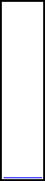
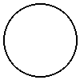
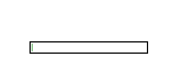

# LoadingBar-Python
Basic Loading Bar

## Description
This project provides a basic loading bar implementation in Python.

## Demo
### Horizontal Loading Bar

The `chargebar_horizontal.gif` demonstrates a horizontal loading bar in action, showing how it progresses over time to indicate the completion of a task.

### Vertical Loading Bar

The `chargebar_vertical.gif` demonstrates a vertical loading bar in action, showing how it progresses over time to indicate the completion of a task.

### Circular Loading Bar

The `chargebar_circular.gif` demonstrates a circular loading bar in action, showing how it progresses over time to indicate the completion of a task.

### Brick Building Loading Bar

The `brick_chargebar.gif` demonstrates an animation where bricks are laid to build a wall and complete a charge bar.

## Files
### loadingbar.py
This file contains the implementation of three types of loading bars:
- **Horizontal Loading Bar**: A standard horizontal loading bar.
- **Vertical Loading Bar**: A vertical loading bar.
- **Circular Loading Bar**: A circular loading bar.

### brick_chargebar.py
This file contains the implementation of an animation where bricks are laid to build a wall and complete a charge bar. The animation shows bricks being added above the charge bar as it fills up.

## Libraries & Image Setup
We import `Image` and `ImageDraw` from Pillow. We create an image with an RGBA mode (allowing transparency) and draw a rectangle as the outer border.

## Frame Creation
The code computes `num_frames + 1` images, each incrementally increasing the fill width of the inner rectangle to simulate a charge filling up.

## Animating
We use Pillow's built-in GIF saving method by passing all frames along with a duration per frame and `loop=0` for infinite looping.

## Customization Ideas
- **Gradient Fill**: Instead of a solid color, you could create a gradient by combining multiple shades.
- **Icon Overlay**: To turn it into an icon, you might overlay a battery outline or a lightning bolt image.
- **Additional Effects**: Consider adding a subtle glow or shadow to enhance the minimalist aesthetic.
